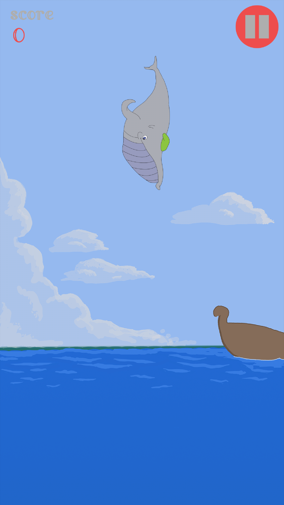
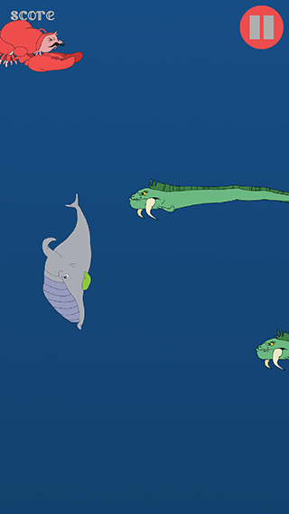
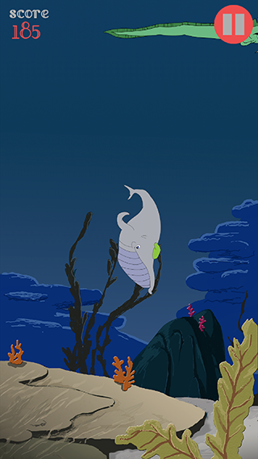

<h2>Table of Contents</h2>

<ul>
<li><a href="#sec-1">Whale</a>
<ul>
<li><a href="#sec-1-1">Downloads</a></li>
<li><a href="#sec-1-2">Screenshots</a></li>
<li><a href="#sec-1-3">Acknowledgments</a></li>
<li><a href="#sec-1-4">Other Projects</a></li>
</ul>
</li>
</ul>

# Whale

**Dodge eels and lobsters as they attempt to ruin your day in the sea.**

*Whale* is a 2D game I built in 9th grade that went unfinished.  Finally found the motivation to finish the score keeping and level generation.

## Downloads

Latest releases for Android can be found [here](https://github.com/woofers/whale/releases).

Can also be downloaded from [Google Play Store](https://play.google.com/store/apps/details?id=com.jaxson.whale).

## Screenshots

## Acknowledgments

-   **Font is** [Little Lord Fontleroy NF](http://www.1001fonts.com/littlelordfontleroy-font.html) **by** *Nick Curtis*

-   **Built using** [HaxeFlixel](http://haxeflixel.com/)

-   **Art by** *Avery Suzuki*

-   **Designed and Programed by** *Jaxson Van Doorn*

-   **Copyright 2014-2017**, *Jaxson Van Doorn and Avery Suzuki*

## Other Projects

-   [Woofers3D](https://github.com/woofers/woofers3d)

-   [K9Krew](https://github.com/woofers/k9-krew)

-   [Dotfiles](https://github.com/woofers/dotfiles)
